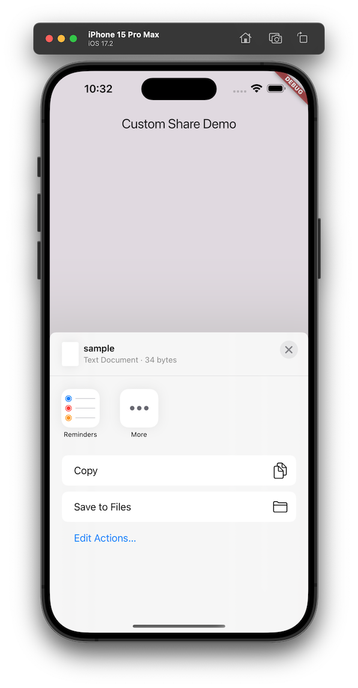

# custom_share

A Flutter plugin for sharing text and files via **NATIVE SHARE UI**, supporting Android , iOS, macOS, Windows, Linux.

# Usage

```dart
import 'package:custom_share/custom_share.dart';

// Share text
final result = await CustomShare().shareText(text: 'Hello from Custom Share!');
print('Share result: $result');

// Share a file
final filePath = '/path/to/sample.txt';
final fileResult = await CustomShare().shareFiles(
  filePaths: [filePath],
  text: 'Sharing a sample file',
  mimeType: 'text/plain',
);
print('File share result: $fileResult');
```
# Screenshot

## IOS



## Android


## macOS


# Platform Support

Android: Uses ACTION_SEND and ACTION_SEND_MULTIPLE.

iOS: Uses UIActivityViewController.

macOS: Uses NSSharingServicePicker.

Windows: Uses Data Transfer API.

Linux: Uses xdg-open.

NOT Support Web: Uses Web Share API (text only; file sharing not supported).

# Example

See the example directory for a sample app demonstrating text and file sharing.

# License

BSD-3-Clause
